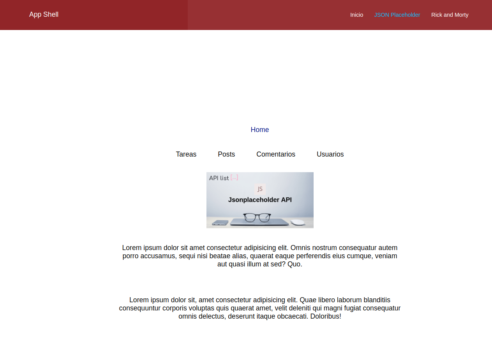
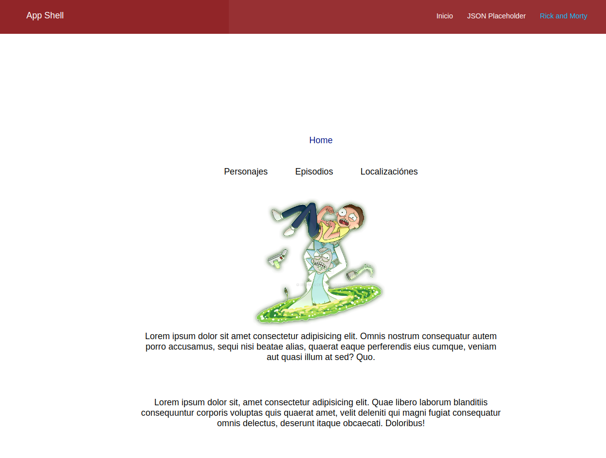

# Microfrontend Nested Router

> [!NOTE]
>
> **Sreenshots**
>
> - Muestra del App Shell y los dos Microfrontend consumidos
> - Cada uno tiene su enrutador propio

    
    
    

 

> [!NOTE]
>
> **Objetivo**
>
> - Utilizar lo minimo indispensable para consumir un microfrontend con su propio enrutador.

 

> [!IMPORTANT]
>
> **Dependencias**
>
> - _Dependencias_ :arrow_right: `pnpm install`
> - _App Shell_ :arrow_right: `pnpm dev`
> - _jsonplaceholder_ :arrow_right: `pnpm run deploy`
> - _rickandmorty_ :arrow_right: `pnpm run deploy`

 

> [!TIP]
>
> **Recursos externos**
>
> - [mfe-shell](https://github.com/pmNiko/mfe-shell)
>
> - [mfe-parcel](https://github.com/pmNiko/mfe-parcel)

 

> [!CAUTION]
>
> **Tener en cuenta**
>
> - Cada app contiene su propio archivo .env.local con las variables de entorno necesarias.
> - El root path del App Shell se utiliza como punto de referencia de los subenrutadores.
> - El root path del App Shell es pasado como prop de los parcel para ser concatenados.
> - Se usa el comodin **`*`** este ayuda en el reload de la app para no perder referencia.
> - Se debe tener especial cuidado al utilizar hojas de estilo css.

 

> [!NOTE]
>
> **Tecnología implementada**
>
> - _Vite_
> - _React TS_
> - _@originjs/vite-plugin-federation_
> - _RRD 6.4_
